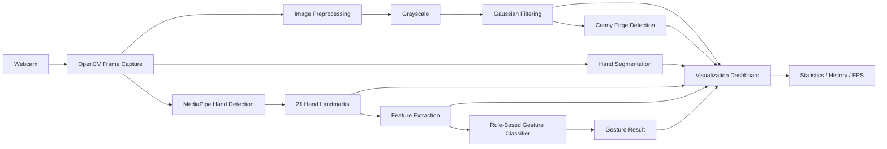
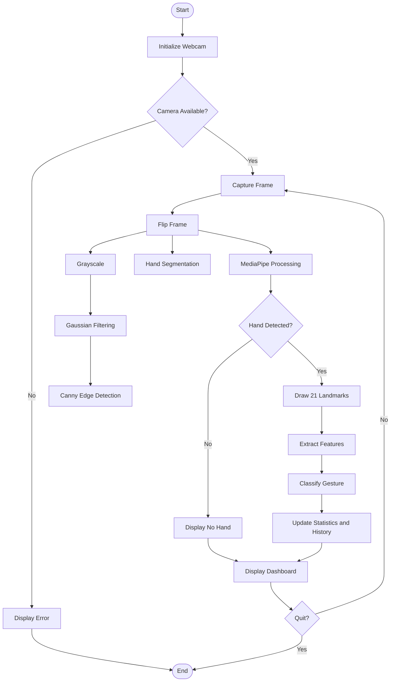
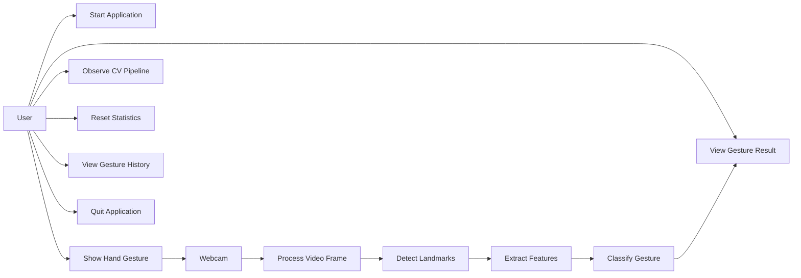
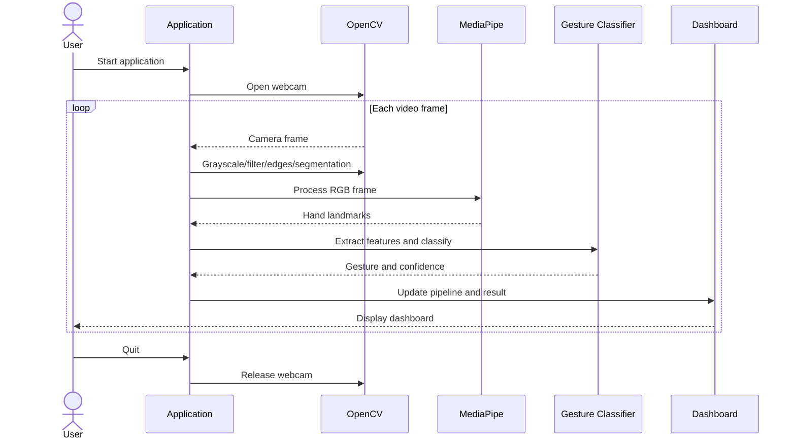
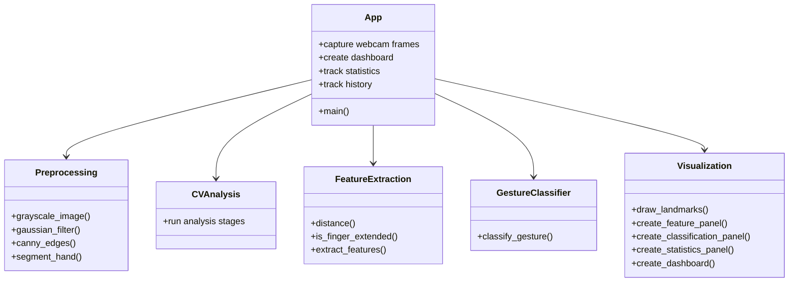

# Design Diagrams

The diagrams below document the **existing** Smart Hand Gesture Recognition implementation. They do not introduce additional application features.

## 1. System Architecture Diagram

## 2. Process Flow Diagram

## 3. Use Case Diagram

## 4. Sequence Diagram

## 5. Component/Class-Level Diagram

## 6. Storage Design

No persistent database is used by the current application. Gesture statistics and history are maintained during the running session. Therefore, an ER diagram is **not applicable** to the present implementation.

## 7. Design Rationale

- OpenCV is used for image and video processing.
- Gaussian filtering is placed before Canny edge detection to reduce image noise.
- MediaPipe is used to obtain a structured representation of the hand through 21 landmarks.
- Feature extraction converts landmark information into geometric/finger information used by the current classifier.
- A rule-based classifier is retained because it is the existing working implementation and no additional ML component is being introduced.
- The dashboard exposes intermediate stages so the Computer Vision workflow can be demonstrated and evaluated.
